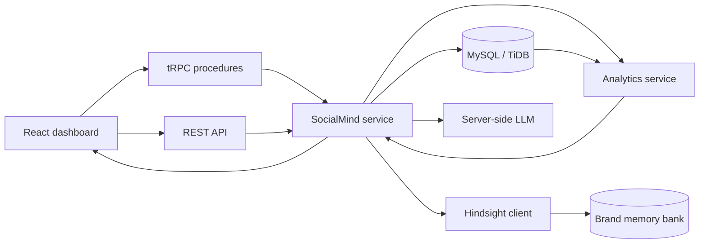

# SocialMind AI architecture

## Request flow

1. The browser calls typed tRPC procedures. REST equivalents exist for integrations and inspection.
2. The SocialMind service loads the persisted brand and posts from Drizzle.
3. Analytics are calculated directly from stored metrics. Engagement rate is based on `(likes + comments + shares) / reach * 100` when a value is not supplied.
4. For strategy requests, the service calls Hindsight `recall` for specific evidence and `reflect` for a synthesized memory-grounded answer.
5. The server-side LLM receives the brand profile, analytics, Hindsight evidence, and reflect output. It returns a structured response when available.
6. The UI renders the recommendation, confidence, source post IDs, and any service limitation.

## Memory lifecycle

| Phase | Trigger | Hindsight operation | Visible UI evidence |
| --- | --- | --- | --- |
| Retain | Import sample data, save brand profile, add post outcome | `retainBatch` or `retain` | Operation trace, status, source post IDs |
| Recall | User searches memory or asks a strategy question | `recall` | Retrieved memories and source post IDs |
| Reflect | Strategy service synthesizes a recommendation | `reflect` | Recommendation evidence and reflect status |

The memory bank is one bank per workspace (`socialmind-technova` by default), not one bank per post. Each retained post includes its post ID, platform, date, topic, format, metrics, and audience response. This keeps a future recommendation traceable to a real stored record.

## Graceful degradation

- Missing Hindsight credentials produce an explicit unavailable state; the app never labels database rows as Hindsight memories.
- Hindsight errors are recorded as failed events and do not erase a successfully saved database post.
- LLM errors fall back to structured analytics-derived output and are not presented as a model-generated result.
- Empty datasets return “Not enough data” instead of fabricated rankings.
